# Lumina: tests and screenshots

Every UI test below drives the real app on Linux at phone size (412 × 892) against an in-memory database, and saves a screenshot of what it checked. The screenshots in this file are produced by the tests themselves, so re-running the tests refreshes them.

## Running the tests

```bash
# Logic: streaks, freezes, repair, migration, reminders, backup, research entries (33 tests, about 1 second)
flutter test

# UI flows, one or more screenshots per test (15 tests, 2 to 4 minutes, needs a display)
flutter test integration_test/habit_flow_test.dart -d linux
```

Screenshots are written to `docs/screenshots/`. To write them somewhere else, add `--dart-define=SHOT_DIR=/some/path`.

## What is not covered by automated tests

These need a real Android phone and have only been compiled, not exercised:

- the daily reminder actually firing at the scheduled time,
- the home-screen widget drawing and opening a reading session when tapped,
- the notification permission prompt,
- the system "save to" and file-picker screens used by backup and restore (the backup file itself is unit tested).

The reminder *content and timing rules* are unit tested (see the last table).

## How the screens are built

- **One hero per screen**: the minutes ring on Today, days read this week on Stats, the cover on a book page. One serif title, one filled green button for the main action; everything else is a tonal pill or plain text.
- **Surfaces, not borders**: warm near-black background with cards one step lighter. Tinted cards mark meaning: amber is the streak, lavender is your own notes and questions, green is the main action and live progress.
- **Two typefaces**: Fraunces for titles and big numbers, Manrope for everything else.
- **A "Why?" chip** next to each mechanic opens the study it is built on. The full list is in Settings → The science. The text lives in `lib/research.dart`.

---

## UI tests

### 1. First run asks for a reading plan

`first run asks for a reading plan`

On a fresh install the app opens the plan screen once. The test fills in the moment, the place and one obstacle plan, saves, and checks the plan line appears on Today, along with the empty state that tells you to add a book.

Built on: Gollwitzer & Sheeran (2006) on if-then plans; Wood & Neal (2007) on habits attaching to a context.

| Plan screen | Today with no book yet |
|---|---|
|  | 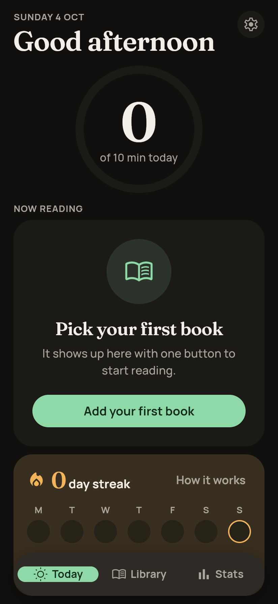 |

### 2. Today shows the streak, the open question and the time left

`today shows the streak, the open question and the time left`

Nine days of reading, nothing logged today. Checks the streak, the week strip (six days ticked, today still open), the banked freeze in words, the "One page keeps the streak" line, the question you left yourself, pages and time left, and that there is exactly one filled button on the screen.

Built on: Silverman & Barasch (2023) on streaks; Loewenstein (1994) on curiosity; Kivetz, Urminsky & Zheng (2006) on speeding up near the end.

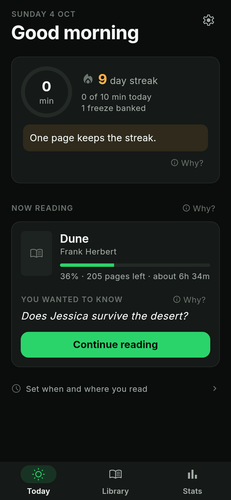

### 3. A why chip opens the finding and its source

`a why chip opens the finding and its source`

Taps the "Why?" chip next to Now reading and checks the sheet shows the finding and the citation. Then follows "See all the science", and opens an entry in the "leaves out on purpose" group.

| Why sheet | The science | Left out on purpose |
|---|---|---|
| 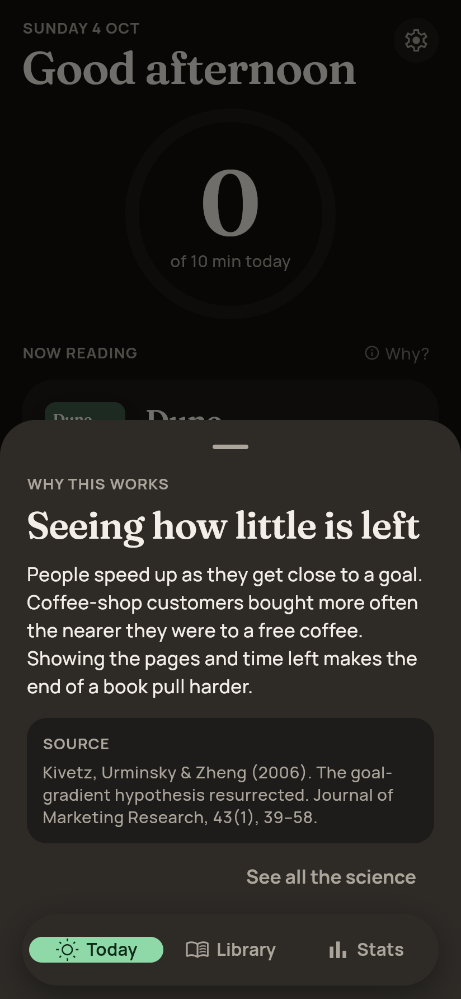 | 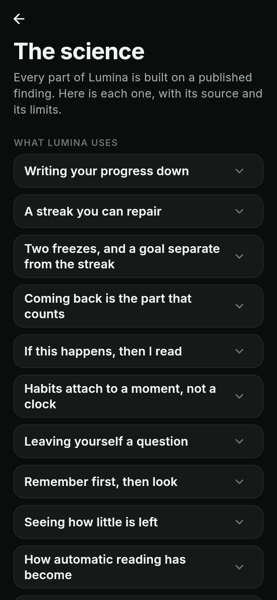 | 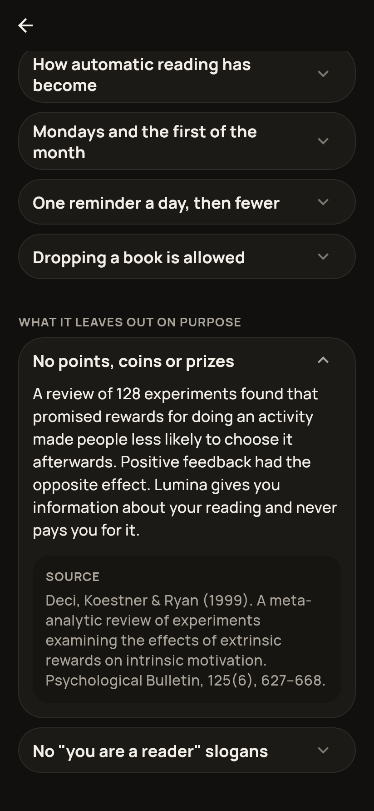 |

### 4. A reading session is timed, logged and hits a milestone

`a reading session is timed, logged and hits a milestone`

Taps Continue reading, lets the timer run, finishes, fills in the wrap-up and saves. Because this is the seventh day in a row, the milestone sheet appears. The test then checks the entry stored a duration and the absorption rating, the session was cleared, and Today shows the new open question.

Built on: Harkin et al. (2016) on recording progress; Roediger & Karpicke (2006) on recalling instead of rereading.

| Session | Wrap-up | Milestone |
|---|---|---|
| 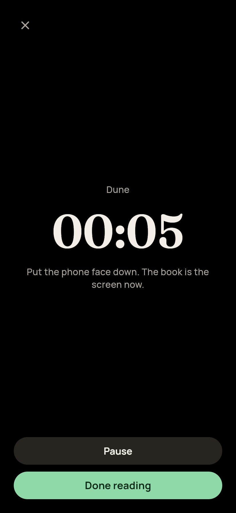 | 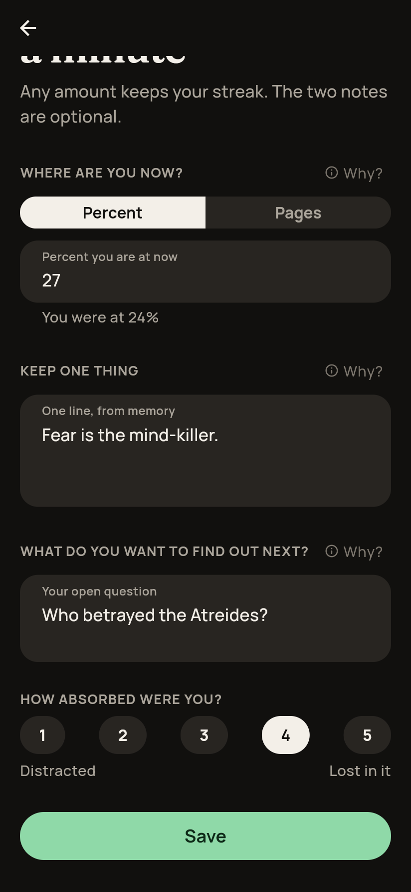 | 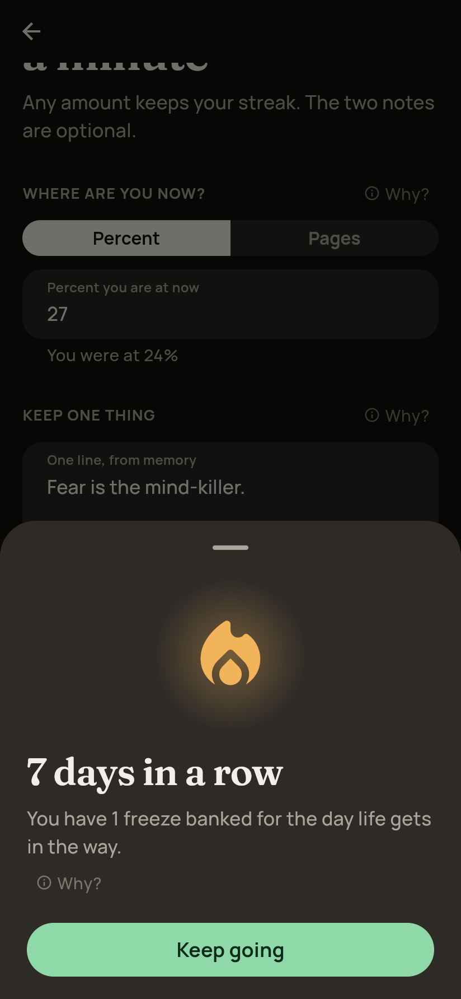 |

### 5. A missed day offers a streak repair

`a missed day offers a streak repair`

Three days read, yesterday missed, no freeze banked. The streak shows 0 and the card offers to bring the 3 day streak back for double the daily goal today.

Built on: Silverman & Barasch (2023): being able to repair a streak removes much of the drop a break causes.

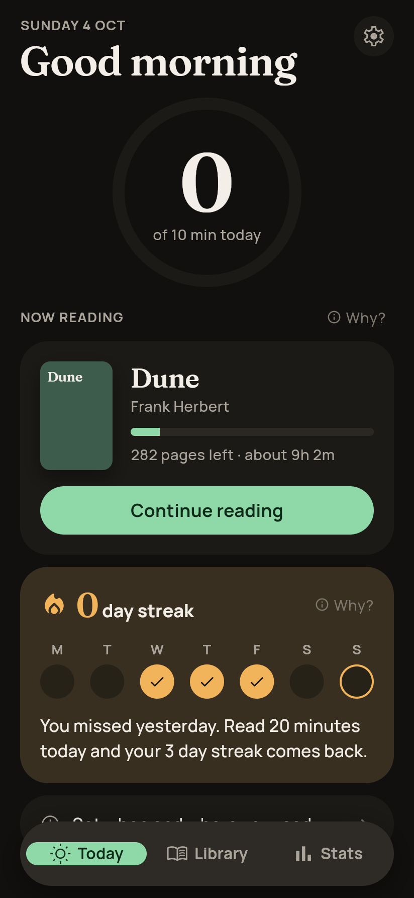

### 6. Coming back after a gap is celebrated

`coming back after a gap is celebrated`

Last read five days ago. The test starts a session, logs it, and checks the comeback sheet appears and the streak restarts at 1.

Built on: Milkman et al. (2021): of 54 programmes tested on 61,293 people, rewarding the return after a miss worked best.

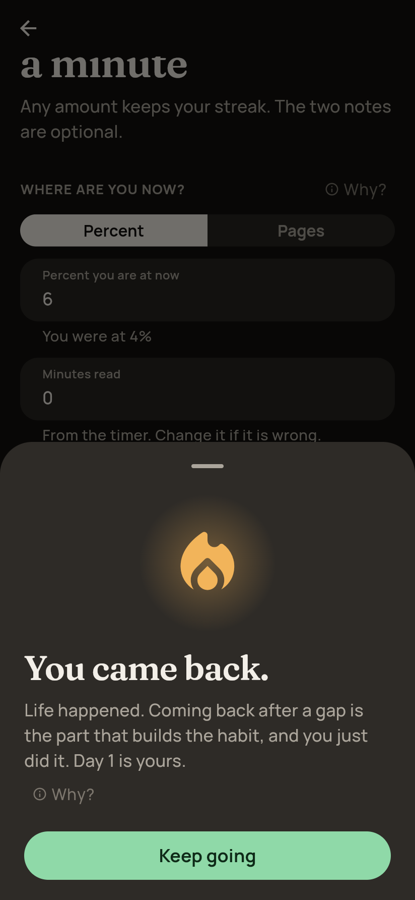

### 7. Library sorts books by shelf and opens a book

`library sorts books by shelf and opens a book`

Two books on different shelves. Checks only the one in progress shows under Reading, opens it, and checks the book page shows the title, the sessions with their note and open question, and the Read now button.

| Library | Book |
|---|---|
| 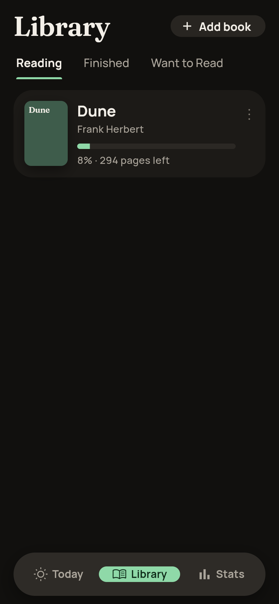 | 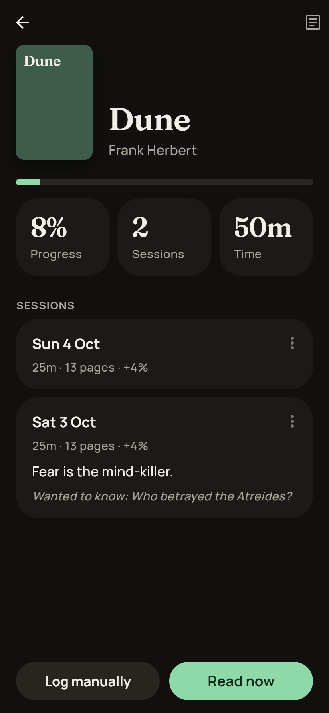 |

### 8. Stats explains itself with no entries

`stats explains itself with no entries`

Opens Stats on an empty database. This screen used to crash here; now it says what will appear.

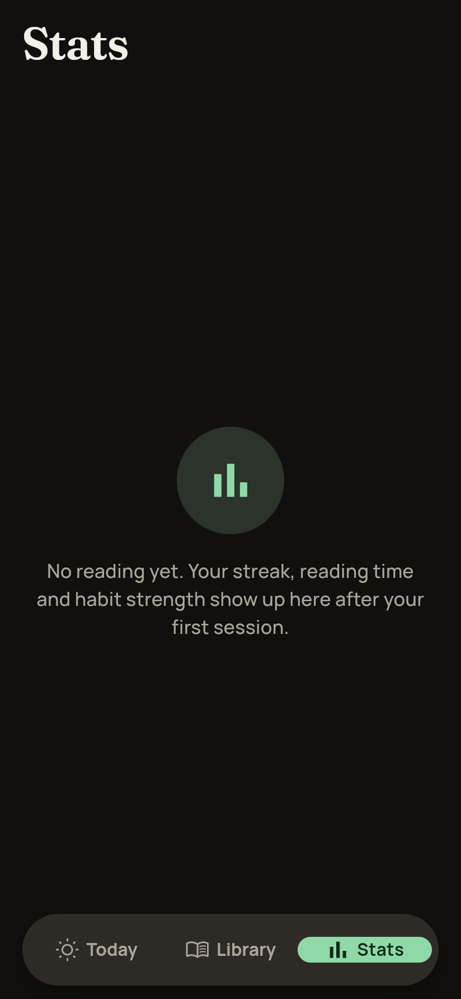

### 9. Stats shows the week, all time and habit strength

`stats shows the week, all time and habit strength`

Ten days of reading plus three automaticity check-ins. Checks the week tiles, the all-time tiles, and scrolls to the habit strength chart.

Built on: Gardner et al. (2012) for the four-question automaticity index; Lally et al. (2010) for the real 18 to 254 day range.

| This week and all time | Habit strength |
|---|---|
| 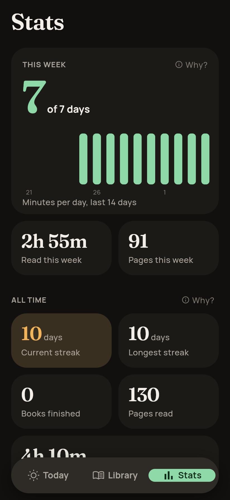 | 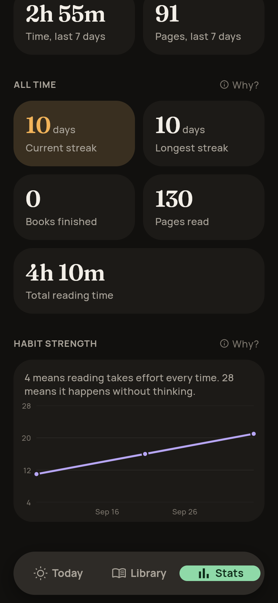 |

### 10. Weekly review records how automatic reading feels

`weekly review records how automatic reading feels`

Opens the review after a full week, checks the summary and the four questions, submits, and checks one check-in was stored.

Built on: Dai, Milkman & Riis (2014) on fresh starts at the beginning of a week or month.

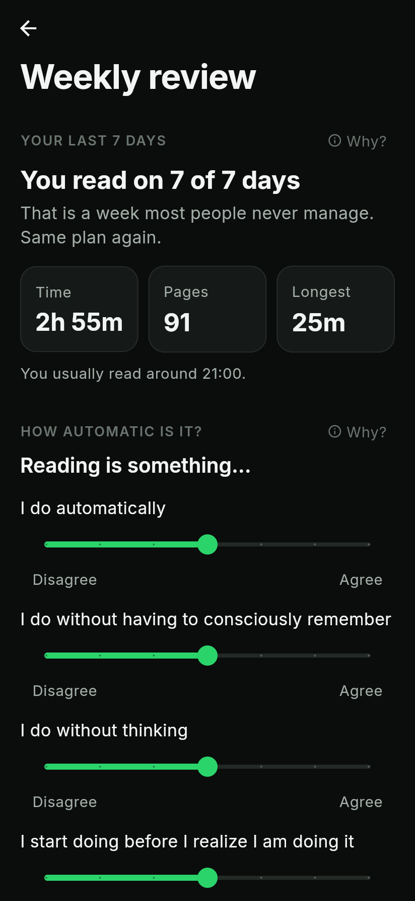

### 11. Settings changes the daily goal

`settings changes the daily goal`

Opens Settings from the gear on Today, picks 20 minutes, checks it is stored, and checks the ring on Today now reads "of 20 min today".

Built on: Duolingo's own experiments (company-reported, not peer-reviewed) on keeping the goal separate from the streak.

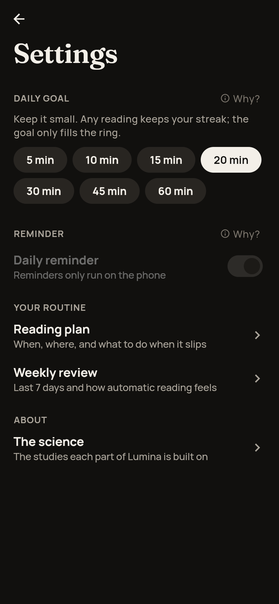

### 12. A book untouched for a week can be dropped

`a book untouched for a week can be dropped`

A book last opened ten days ago triggers the sheet. The test taps Drop it, checks the book is marked paused, and checks the Reading shelf now explains that nothing is in progress.

This one is a design choice; the app says so, and cites no study.

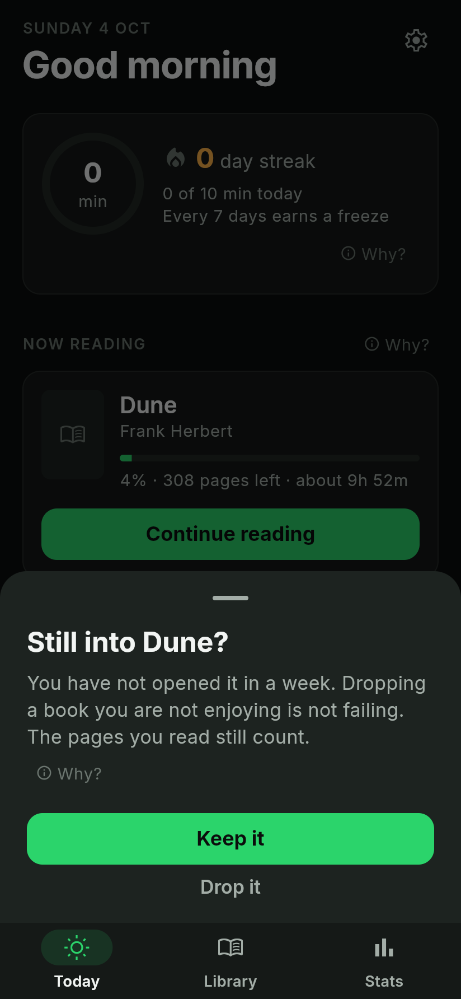

### 13. Yesterday's note comes back as a recall prompt

`yesterday's note comes back as a recall prompt`

A note written yesterday is offered as a recall question first, then revealed. Notes resurface 1, 7 and 30 days after they were written.

Built on: Roediger & Karpicke (2006): 61% retained after a week when recalling, 40% when rereading.

| Prompt | Your note |
|---|---|
| 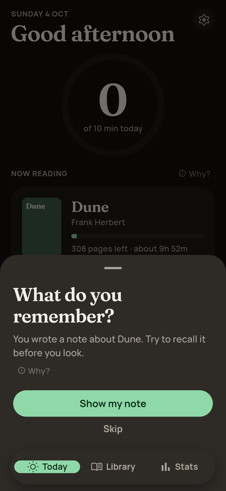 | 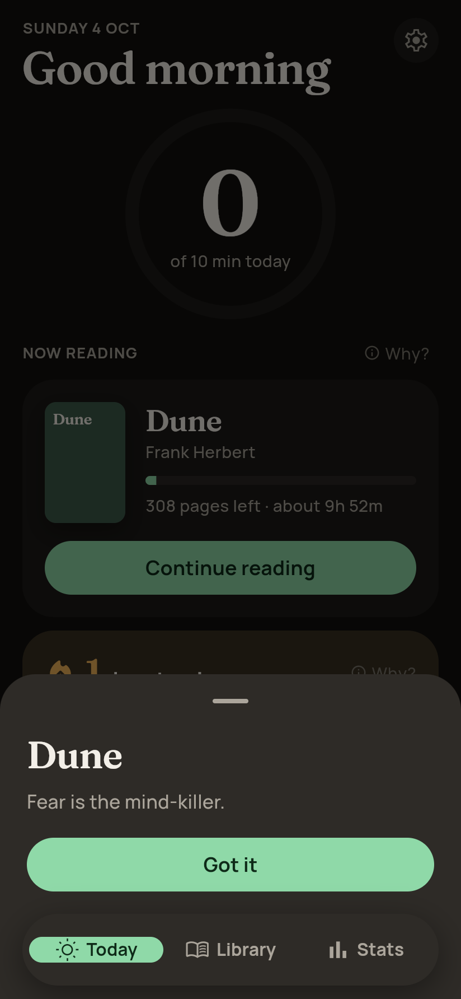 |

### 14. The streak card draws on its own for the home-screen widget

`the streak card draws on its own for the home-screen widget`

The "Lumina streak" home-screen widget shows the same card as Today. Android widgets cannot run Flutter, so the app draws the card to an image and the widget displays it. This test draws the card the same way, with no app around it, and checks the streak, the week dots (five ticks, one freeze, today open) and that the "Why?" chip is left out.

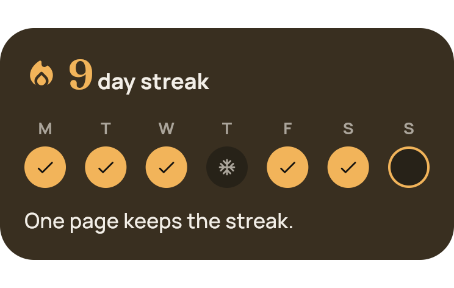

### 15. Logging without the timer can still fill the ring

`logging without the timer can still fill the ring`

You log where your bookmark is, not how many pages you read. The form shows where you were ("You were on page 13 of 320"). The test logs page 24 with no minutes: the streak counts and the ring says "Read today · no time logged". Then it logs page 42 with 12 minutes and checks that 18 pages were added (not 42), the ring shows 12, and Today says 278 pages left.

| Logging the page you are on | Today afterwards |
|---|---|
| 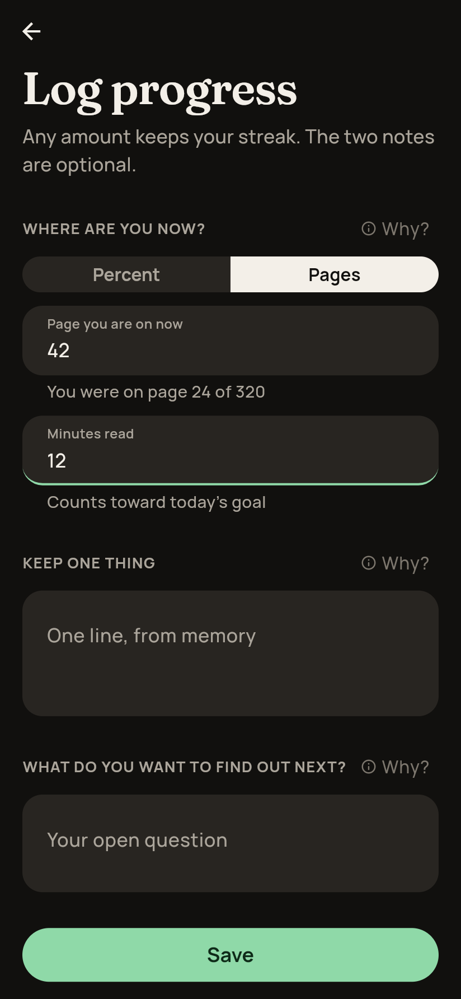 | 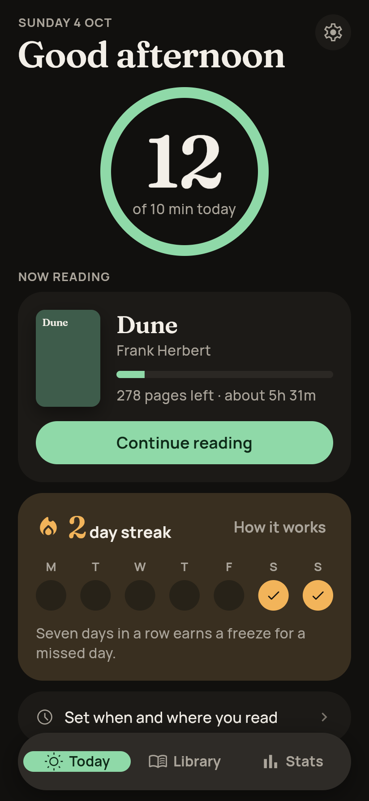 |

---

## Logic tests

`test/habit_services_test.dart`. These have no screen, so no screenshot.

| Group | Test | What it proves |
|---|---|---|
| streak | counts consecutive days including today | Four days in a row is a streak of 4 |
| streak | stays alive while today is still open | Not having read yet today does not break it |
| streak | a missed day spends a banked freeze instead of resetting | Seven days earn a freeze; the gap day uses it; replaying does not spend a second one |
| streak | banks at most two freezes | Thirty days in a row still gives 2 |
| streak | a miss with no freeze resets and offers a repair | Streak 0, longest kept, repair offered for the lost 3 |
| streak | doubling the daily goal the next day repairs the streak | 20 minutes the day after restores it to 4 |
| streak | a short session the next day does not repair | 1 minute gives a new streak of 1, repair still on offer |
| streak | the repair window closes after one day | A big session three days later repairs nothing |
| celebrations | the comeback is celebrated once | Shown on the first entry after a gap, not again that day |
| celebrations | a streak milestone is celebrated once | Day 7 shows once |
| entries | a timed session that rounds to 0% is still saved | Two pages of a 900-page book still count for the streak |
| entries | an entry with no progress and no session is ignored | Empty entries are not stored |
| entries | today shows the hook, pages left and time left | Pace is computed from your own sessions |
| coherence | a book is finished at 100%, not before | At 90% it is still on Today; at 100% it moves to Finished; deleting the last entry moves it back |
| coherence | the page typed is where you are, not how many you read | Was on page 24, now on 42: 18 pages are added |
| coherence | the percent typed is where you are, and records the pages | Was at 10%, now at 25% of 320 pages: 15% and 48 pages are added |
| coherence | short sessions add up instead of rounding to nothing | Three pages at a time through a 900-page book reaches page 18 and 2% |
| coherence | reaching the last page finishes the book | Page 300 of 300 brings the book to 100% |
| coherence | pages left counts from the page you are on | On page 42 of 320 there are 278 left |
| coherence | the ring, the streak and the stats read the same entries | One session shows the same minutes, pages and day on Today, the week strip and Stats |
| migration | a version 1 database upgrades with its rows intact | Existing books and entries survive; deleting a book now removes its entries |
| reminders | fire a little before the usual reading time | 15 minutes before your median entry time; 20:00 with no history |
| reminders | count how many in a row were ignored | Used to drop to every other day after five ignored |
| reminders | are written from the reader's own notes | Your hook, pages left, streak and plan, in rotation |
| backup | a backup restores everything on an empty device | Books, sessions, notes, goal, plan, freezes and habit check-ins all come back; a half-finished session does not |
| backup | restoring replaces what is on the device | A book added after the backup is gone after restoring |
| backup | a file that is not a backup is refused and changes nothing | Random files, other apps' files and backups from a newer version are rejected |
| backup | a backup with a broken row restores nothing | A damaged file rolls back completely instead of half-restoring |
| backup | the file is named by date | `lumina-backup-2026-03-05.json` |
| research | every why chip in the app points at a real entry | No "Why?" chip can open an empty sheet |
| research | every entry cites a source or says it has none | No finding is shown without a citation or an explicit "no study" note |
