# Lumina habit engine: tests and screenshots

Every UI test below drives the real app on Linux at phone size (412 × 892) against an in-memory database, and saves a screenshot of what it checked. The screenshots in this file are produced by the tests themselves, so re-running the tests refreshes them.

## Running the tests

```bash
# Logic: streaks, freezes, repair, migration, reminders (17 tests, about 1 second)
flutter test

# UI flows, one or more screenshots per test (11 tests, about 90 seconds, needs a display)
flutter test integration_test/habit_flow_test.dart -d linux
```

Screenshots are written to `docs/screenshots/`. To write them somewhere else, add `--dart-define=SHOT_DIR=/some/path`.

## What is not covered by automated tests

These need a real Android phone and have only been compiled, not exercised:

- the daily reminder actually firing at the scheduled time,
- the home-screen widget drawing and opening a reading session when tapped,
- the notification permission prompt.

The reminder *content and timing rules* are unit tested (see the last table).

---

## UI tests

### 1. First run asks for a reading plan

`first run asks for a reading plan`

On a fresh install the app opens the plan screen once. The test fills in the cue, the place and one obstacle plan, saves, and checks the plan line appears on the home card.

Why it exists: if-then plans roughly double follow-through (Gollwitzer & Sheeran 2006, d = 0.65), and habits attach to a cue rather than a clock time (Wood & Neal 2007).

| Plan screen | Plan shown on home |
|---|---|
| 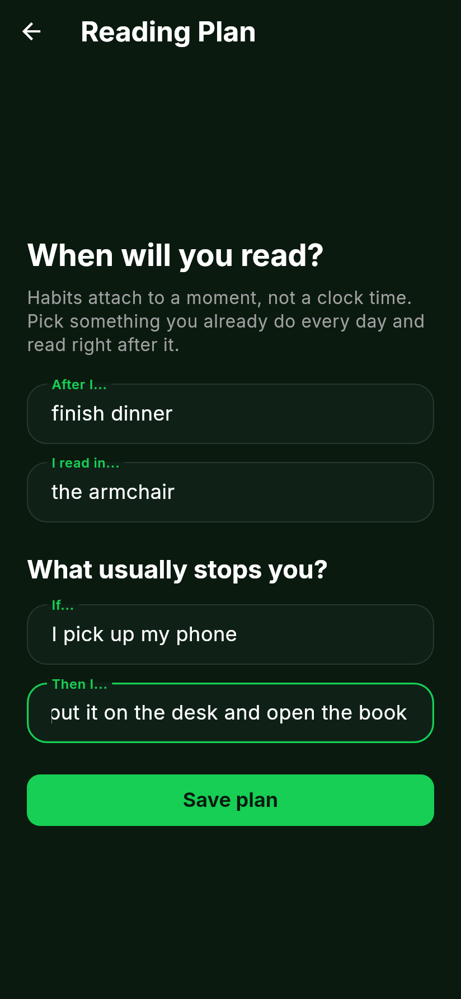 | 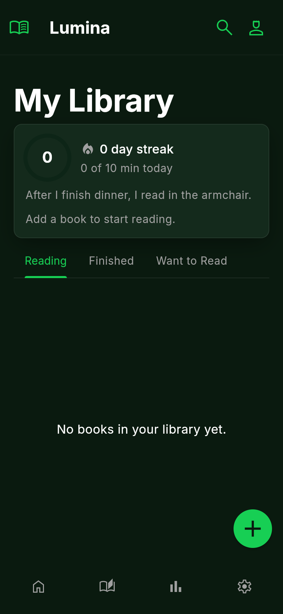 |

### 2. Today card shows the streak, the hook and the time left

`today card shows the streak, the hook and the time left`

With nine days of reading and nothing logged today, the card shows a 9 day streak, one banked freeze (the snowflake), the "One page keeps the streak" nudge, the question you left yourself last time, and pages and time left at your own pace.

Why it exists: an intact visible streak drives the next session (Silverman & Barasch 2023); your own open question pulls you back (Loewenstein 1994); visible distance to the end speeds you up (Kivetz 2006).

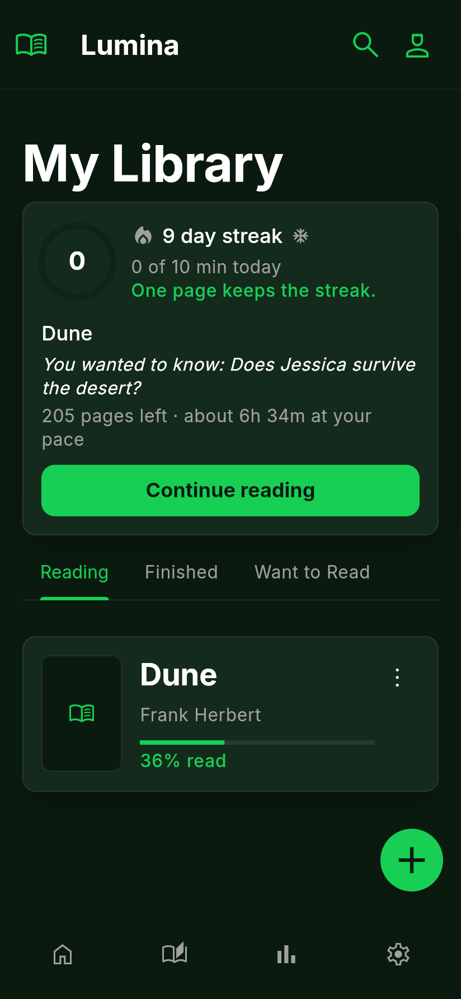

### 3. A reading session is timed, logged and hits a milestone

`a reading session is timed, logged and hits a milestone`

Taps Continue reading, lets the timer run, finishes, fills in the wrap-up (progress, one thing worth keeping, what you want to find out next, how absorbed you were) and saves. Because this is the seventh day in a row, the milestone appears. The test then checks the entry stored a duration and the absorption rating, the session was cleared, and the home card shows the new hook.

Why it exists: recording progress is one of the best-supported mechanisms (Harkin 2016, d = 0.40); writing one recalled line beats rereading (Roediger & Karpicke 2006).

| Session | Wrap-up | Milestone |
|---|---|---|
| 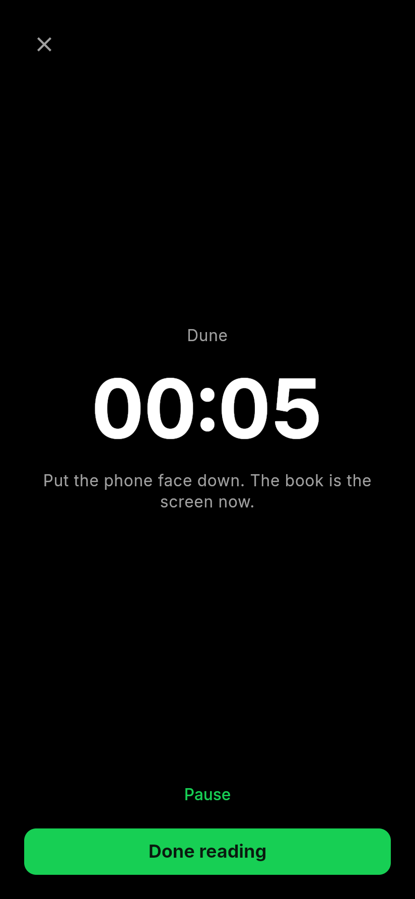 | 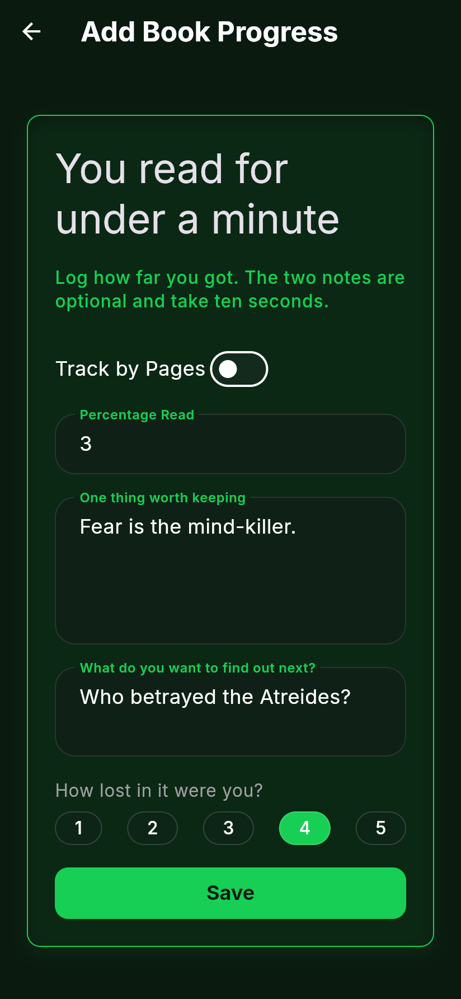 | 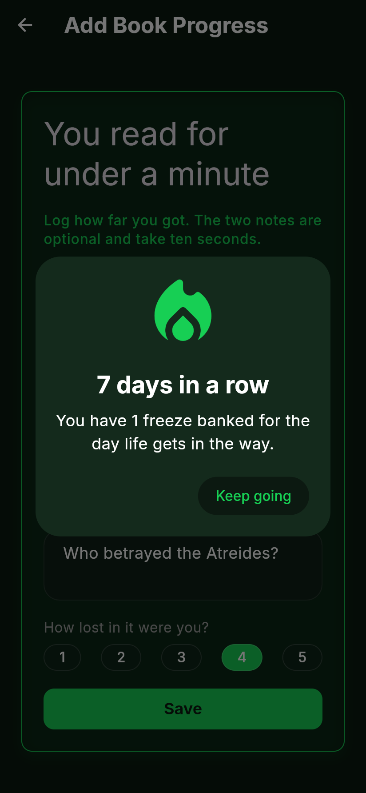 |

### 4. A missed day offers a streak repair

`a missed day offers a streak repair`

Three days read, yesterday missed, no freeze banked. The streak shows 0 but the card offers to bring the 3 day streak back for double the daily goal today.

Why it exists: a broken streak demotivates far more than the missed day itself, and being able to repair it removes most of that drop (Silverman & Barasch 2023).

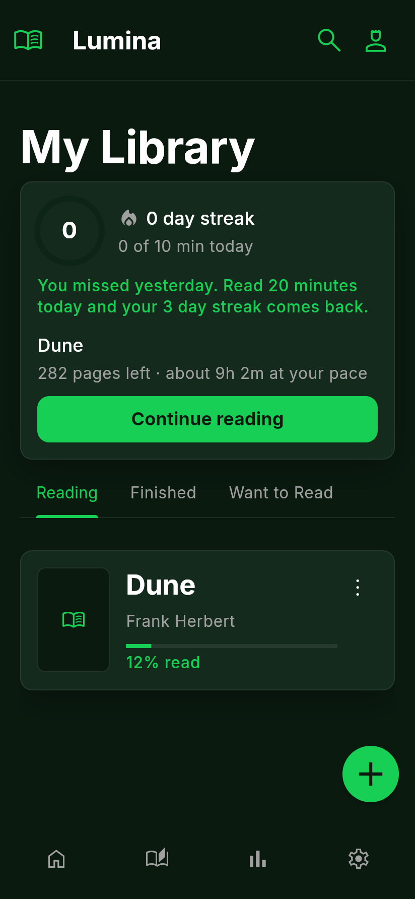

### 5. Coming back after a gap is celebrated

`coming back after a gap is celebrated`

Last read five days ago. The test starts a session from the bottom bar, logs it, and checks the comeback moment appears and the streak restarts at 1.

Why it exists: in a 61,000-person study of 54 programmes, rewarding the return after a miss was the single most effective (Milkman et al. 2021, +27%).

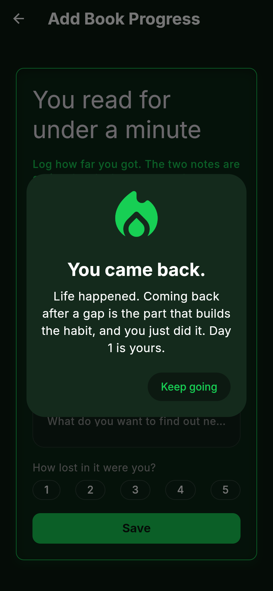

### 6. Statistics opens with no entries

`statistics opens with no entries`

Opens statistics on an empty database. This used to crash because the chart read the first data point before checking for an empty list.

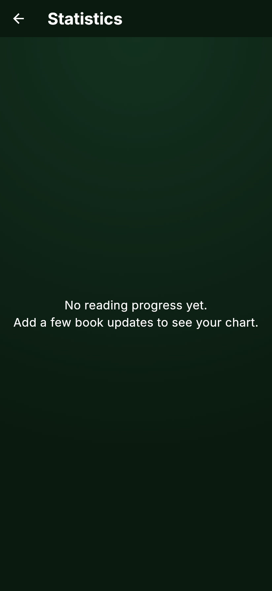

### 7. Statistics shows streaks, reading time and habit strength

`statistics shows streaks, reading time and habit strength`

Ten days of reading plus three automaticity check-ins. Checks the new tiles (longest streak, 7-day time, usual hour, lifetime pages) and scrolls to the habit strength chart.

Why it exists: the habit strength line is your own score on the 4-item automaticity index (Gardner 2012). It replaces the "66 days" myth with a real curve; habit formation actually takes 18 to 254 days (Lally 2010).

| Tiles | Habit strength |
|---|---|
| 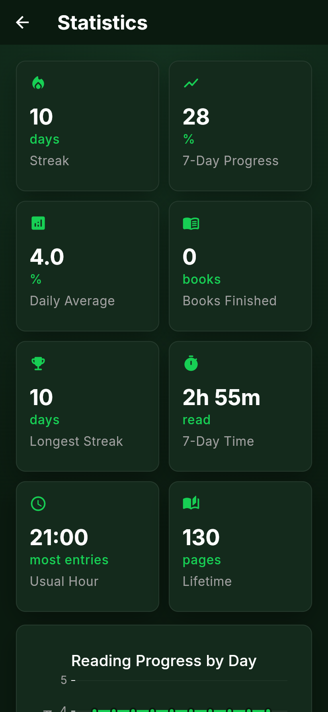 | 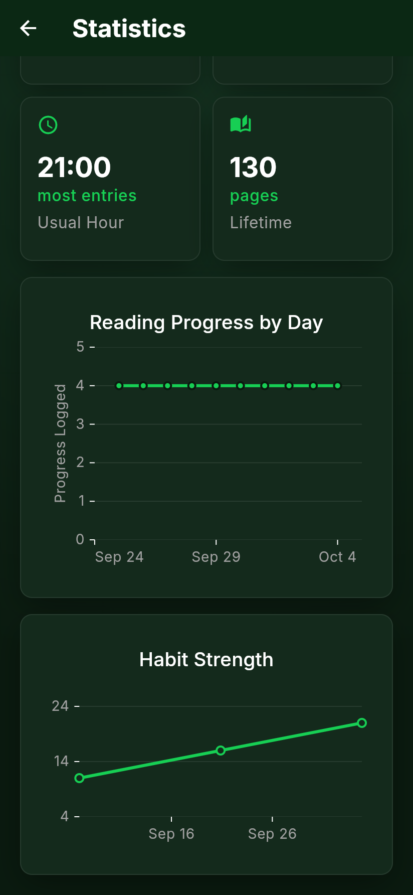 |

### 8. Weekly review records how automatic reading feels

`weekly review records how automatic reading feels`

Opens the review after a full week, checks the summary and the four automaticity questions, submits, and checks one check-in was stored.

Why it exists: the review is offered on Mondays and the 1st of the month, when people are most willing to restart (Dai, Milkman & Riis 2014).

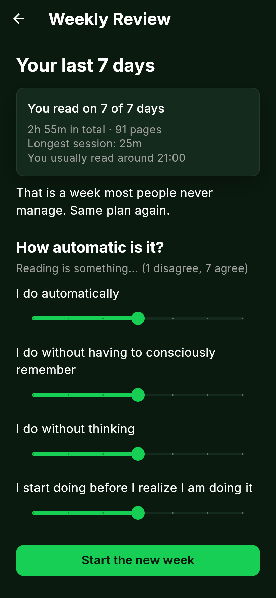

### 9. Settings changes the daily goal

`settings changes the daily goal`

Picks 20 minutes, checks it is stored, and checks the home card now reads "0 of 20 min today".

Why it exists: the goal only fills the ring. Any reading keeps the streak, because separating the two kept more people going in Duolingo's experiments (+3.3% day-14 retention).

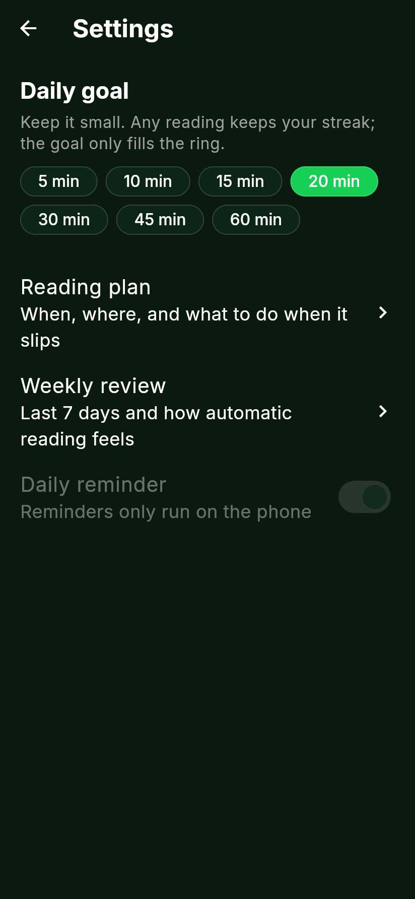

### 10. A book untouched for a week can be dropped

`a book untouched for a week can be dropped`

A book last opened ten days ago triggers the prompt. The test taps Drop it and checks the book is marked abandoned and leaves the Reading tab.

Why it exists: a book you are not enjoying stalls the whole habit. Dropping it keeps the pages you read.

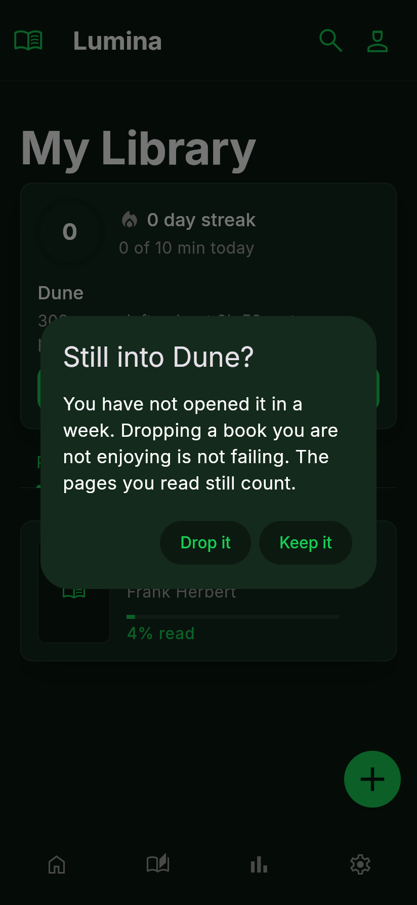

### 11. Yesterday's note comes back as a recall prompt

`yesterday's note comes back as a recall prompt`

A note written yesterday is offered as a recall question first, then revealed. Notes resurface 1, 7 and 30 days after they were written.

Why it exists: trying to recall before looking is what makes it stick (Roediger & Karpicke 2006: 61% versus 40% retained after a week).

| Prompt | Your note |
|---|---|
| 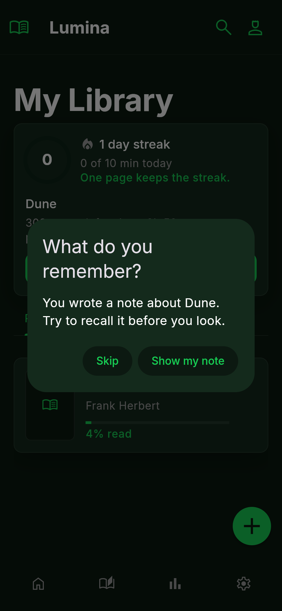 | 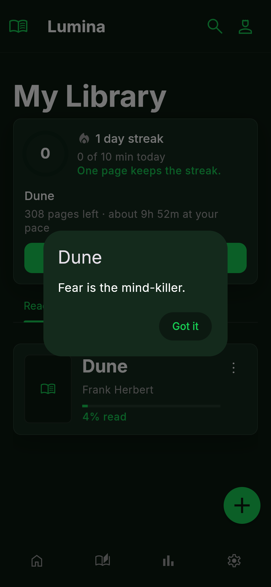 |

---

## Logic tests

`test/habit_services_test.dart`. These have no screen, so no screenshot.

| Group | Test | What it proves |
|---|---|---|
| streak | counts consecutive days including today | Four days in a row is a streak of 4 |
| streak | stays alive while today is still open | Not having read yet today does not break it |
| streak | a missed day spends a banked freeze instead of resetting | Seven days earn a freeze; the gap day uses it; replaying does not spend a second one |
| streak | banks at most two freezes | Thirty days in a row still gives 2 |
| streak | a miss with no freeze resets and offers a repair | Streak 0, longest kept, repair offered for the lost 3 |
| streak | doubling the daily goal the next day repairs the streak | 20 minutes the day after restores it to 4 |
| streak | a short session the next day does not repair | 1 minute gives a new streak of 1, repair still on offer |
| streak | the repair window closes after one day | A big session three days later repairs nothing |
| celebrations | the comeback is celebrated once | Shown on the first entry after a gap, not again that day |
| celebrations | a streak milestone is celebrated once | Day 7 shows once |
| entries | a timed session that rounds to 0% is still saved | Two pages of a 900-page book still count for the streak |
| entries | an entry with no progress and no session is ignored | Empty entries are not stored |
| entries | today shows the hook, pages left and time left | Pace is computed from your own sessions |
| migration | a version 1 database upgrades with its rows intact | Existing books and entries survive; deleting a book now removes its entries |
| reminders | fire a little before the usual reading time | 15 minutes before your median entry time; 20:00 with no history |
| reminders | count how many in a row were ignored | Used to drop to every other day after five ignored |
| reminders | are written from the reader's own notes | Your hook, pages left, streak and plan, in rotation |
